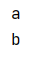
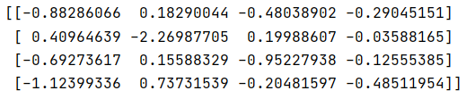

# python基础

## 迭代器

```python
some_dict = {'a':1, 'b':2, 'c':3}
print(some_dict)
```


```python
some_dict = {'a':1, 'b':2, 'c':3}
# print(some_dict)

for key in some_dict:
    print(key)
```


1.iter()，创建迭代器

2.next()

```python
some_dict = {'a':1, 'b':2, 'c':3}

dict_iterator = iter(some_dict)
print(dict_iterator)
```


```python
some_dict = {'a':1, 'b':2, 'c':3}

dict_iterator = iter(some_dict)
print(next(dict_iterator))
print(next(dict_iterator))
```



除了next函数调用迭代器，还可通过for循环

```python
some_dict = {'a':1, 'b':2, 'c':3}

dict_iterator = iter(some_dict)
for i in dict_iterator:
    print(i)
```


## 生成器

生成器是一种计算机制，边循环边计算

```python
g = (x*x for x in range(5))
print(g)
```


```python
g = (x*x for x in range(5))
print(next(g))
print(next(g))
print(next(g))
print(next(g))
```


除了next()也可以使用for循环调用

```python
g = (x*x for x in range(5))
print(next(g))
print(next(g))
print("for循环\n")
for i in g:
    print(i)
```


通过函数创建生成器，yeild

生成一个等差数列

```python
def seq_g(max):
    x = 1
    d = 2
    while x < max:
        yield(x)
        x+=d

g1 = seq_g(20)

print(next(g1))
print(next(g1))
print(next(g1))
print(next(g1))
```


## 时间与日期

```python
from datetime import datetime
dt1 = datetime(2020,1,1,10,42,25)
print(dt1)
```


```python
print(dt1.day)
```


```python
print(dt1.date())
```


```python
string_dt = '2020-12-12'
print(datetime.strptime(string_dt, '%Y-%m-%d'))
```


## Numpy

## ndarray

```python
import numpy as np

data1 = [6, 7, 8]
a1 = np.array(data1)
print(a1)
data2 = [[1, 2, 3, 4], [5, 6, 7, 8]]
a2 = np.array(data2)
print(a2)
```


### zero

```python
print(np.zeros(10))
```


### one

```python
print(np.ones(10))
```


### 数组与标量之间的运算

```py
nd = np.array([1, 2, 3, 4])
print(nd*2)
```


```python
print(nd*nd)
```


## 基本索引和切片

```
print(np.arange(1, 20, 2))
nd1 = np.arange(1, 20, 2)
print(nd1[5])
```


```python
print(nd1[2:5])
```


### 通过索引赋值

```python
nd1[2:5] = 10
print(nd1)
```


```python
data2 = [[1, 2, 3, 4], [5, 6, 7, 8]]
a2 = np.array(data2)
print(a2)
print(a2[0])
```


## 花式索引

```python
nd = np.arange(32)
print(nd)
nd1 = np.reshape(nd, (8, 4))
print(nd1)
```


```python
print(nd1[[4, 6, 3, 1]])
```


```python
print(nd1[[1, 5, 7, 2], [0, 3, 1, 2]])
```


```python
print(nd1[[1, 5, 7, 2]][:, [0, 3, 1, 2]])
```


```python
print(nd1[np.ix_([1,5,7,2],[0,3,1,2])])
```


## 通用函数ufunc

### sqrt函数

```python
arr = np.arange(10)
print(np.sqrt(arr))
```


### add函数

```python
b = np.arange(3)
print(b)
c = np.array([2, -1, 4])
print(c)
print(np.add(b, c))
```


### maximum函数

```python
print(np.maximum(b, c))
```


## 常用数学和统计方法

```python
arr1 = np.random.randn(9)
print(arr1)
# 最值
print(arr1.min())
print(arr1.max())
# 均值
print(arr1.mean())
# 求和
print(arr1.sum())
# 排序
arr1.sort()
print(arr1)
```


```python
arr2 = np.random.randn(5, 3)
print(arr2)
print(arr2.min())
print(arr2.max())
print(arr2.mean())
print(arr2.sum())
# 行排序
arr2.sort()
print(arr2)
# 列排序
arr2.sort(axis=0)
print(arr2)
```


### linspace

均匀分布

```python
a = np.linspace(0, 10, 2)
print(a)
```


```python
b = np.linspace(0, 10, 5)
print(b)
```


## 线性代数

### 矩阵乘法

dot方法

```
x = np.array([[1, 2, 3], [4, 5, 6]])
print(x)
y = np.array([[6, 23], [-1, 7], [8, 9]])
print(y)
z = x.dot(y)
print(z)
```


### 矩阵的逆

numpy.linalg 的 inv方法

```python
from numpy.linalg import inv
m = np.array([[4, 2], [3, 1]])
print(inv(m))
```


### 随机数的生成

#### normal

```python
from numpy import random
rArray = random.normal(size=(4, 4))
print(rArray)
```



#### randint

```python
random.randint(0, 3)
i = 0
while i < 5:
    print(random.randint(0, 2))
    i += 1
```


