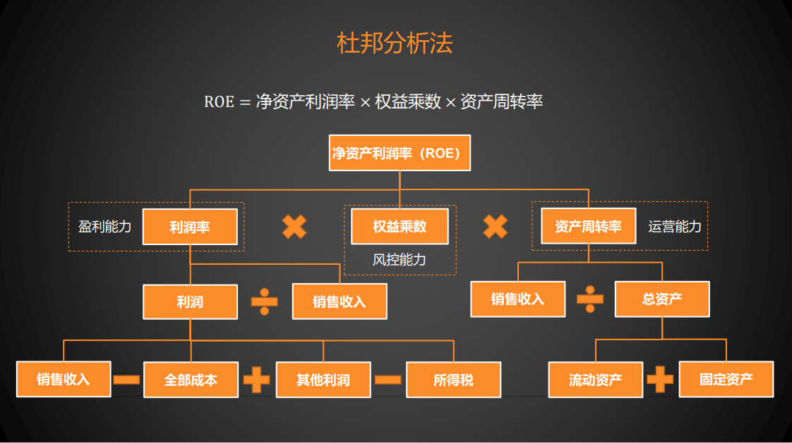
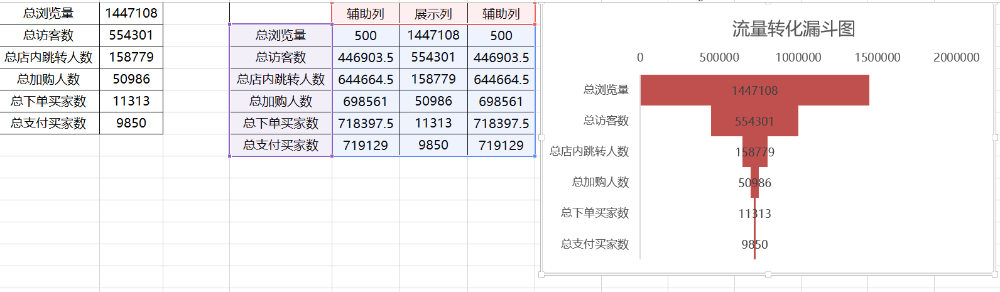
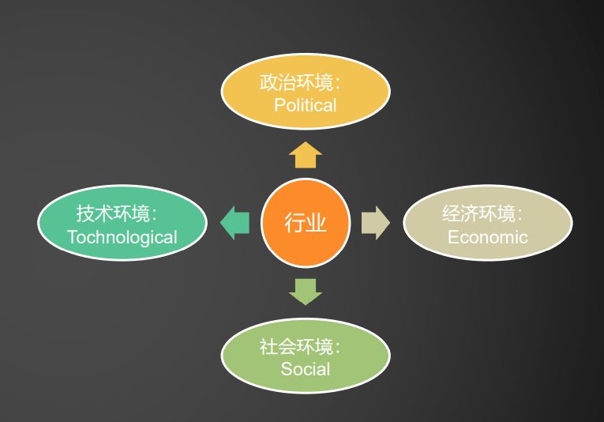
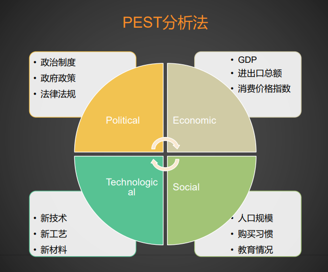
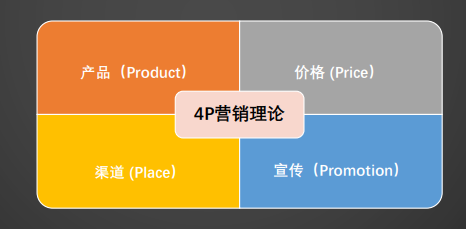
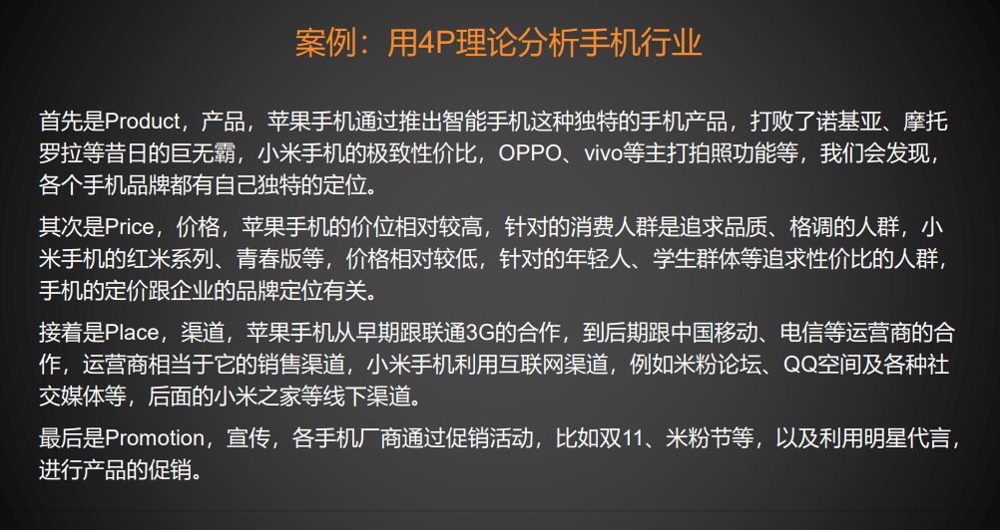
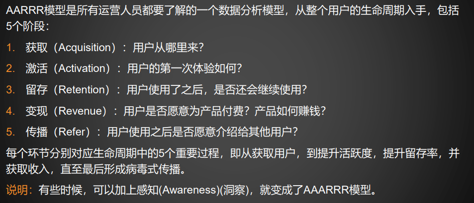
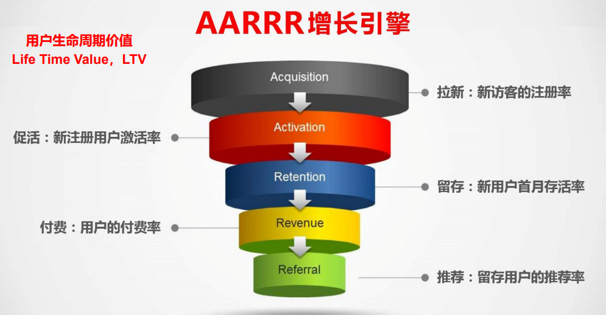
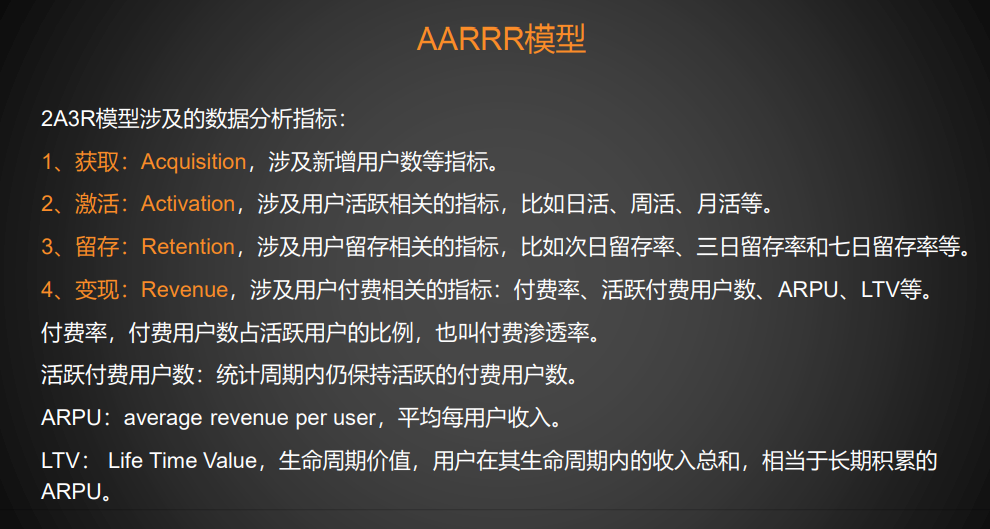
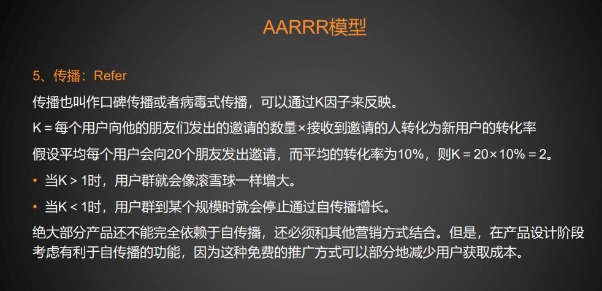

# 对比分析法

对比分析法是指将两个或者两个以上的指标进行对比分析，通过对比分析可以直观地看到事物的变化或者差距。

对比分析可以基于时间进行对比，也可以基于分类（地区、部门、类别等）对比。 

例如，利用对比分析法分析某公司的历年销售额的变化，基于时间的对比通常用折线图。

.png)

例如，通过对比分析法分析不同地区的销售额，基于分类的对比通常采用柱形图或者条形图。

.png)

基于时间的对比有两个常用的指标：同比和环比。

同比：分析指标与同期进行比较，一般用于两年相同月份的比较上。 

环比：分析指标与相邻周期（上个月）进行比较，一般用于相邻月份的比较上。

# 分组分析法

分组分析法主要用于查看数据的分布，即绘制直方图。

# 结构分析法

结构分析法主要用于分析总体内各部分占总体的比例。

结构分析法也可以添加时间维度，例如，对比不同年份的不同产品类别的销售额，一般采用堆 积柱形图表示。

# 交叉分析法

交叉分析法主要用于分析两个变量之间的关系，通过交叉表呈现，二维交叉表也叫列联表。 例如，分析不同地区的各产品类别的销售额，绘制出如下交叉表，对于交叉表，可以通过雷达 图进行展示。

# 矩阵分析法

矩阵分析法，也叫波士顿矩阵分析法，就是以事物的两个属性为坐标轴，绘制散点图。

# 杜邦分析法

杜邦分析法，由美国杜邦公司创造并最先采用的一种综合分析方法，主要是利用企业的主要财 务指标来分析企业的财务状况。

杜邦分析中的核心概念：净资产回报率，return on equity，ROE，也叫净资产收益率。

例如，某企业有初始资金100万元，想要代理某种产品然后销售，这里的100万元就是总权益资 产，此时，总资产等于总权益资产，为100万元。

假设产品的进货单价为1万，100万元能够进货100个，一个卖1万2，卖一批货的销售收入就是 120万元，利润就是120-100=20万元。

假设一年卖一次，即100个，此时，ROE=净利润/总权益资产=20/100=20%，所以 ROE = 净资产利润率

现在，该企业想提高ROE，有以下三种办法：

1、涨价：售价提高为1万5，则卖一批货（100个）的利润就是50万，ROE提升至50%。

2、借钱多进货：向银行借款150万，总资产变成250万，此时能够进货250个，一年的利润就是 250*0.2=50万，ROE提升至：50%，这种方法叫作加杠杆，此时总权益资产仍然是100万，借来的150万叫作负债。

杠杆比率：总资产/总权益资产，这里，总资产为250万，总权益资产为100万，杠杆比率为 250/100=2.5，杠杆比率也叫权益乘数。

ROE = 净资产利润率 × 权益乘数

说明：没有负债的情况下，权益乘数就是1，即ROE = 净资产利润率 × 1

3、多卖几批货：一年卖2.5次（250个），则一年的利润就是50万，ROE也提升至50%。 这种方法叫作提升资产周转率，如果之前的资产周转率记为1，现在的资产周转率则为2.5 ROE = 净资产利润率 × 资产周转率

ROE = 净资产利润率 × 权益乘数 × 资产周转率

# 漏斗图分析法

漏斗图分析法是指通过漏斗图来分析业务问题，适合业务流程规范、周期长、多环节的业务问题。

# PEST分析法

PEST分别是四个单词的首字母，其中：

P：Political，政治环境。

E：Economic，经济环境。

S：Social，社会环境。

T：Technological，技术环境。

PEST分析法主要用于对行业的宏观环境的分析，虽然不同行业和企业有其自身特点和经营要素， 分析的具体内容会有差异，但一般都可以从PEST这四个方面进行分析。

# 4P营销理论

4P营销理论，对应英文为The Marketing Theory of 4Ps，该理论产生于20世纪60年代的美国， 随着营销组合理论的提出而出现的。

# AARRR模型

