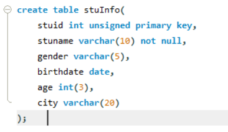

# 数据库常用操作

## 查看有哪些数据库

```mysql
show databases;
```

## 创建数据库

```mysql
create database Testdb;
```

## 创建数据库，并指定编码格式

```mysql
create database mydb character set	utf8mb4;
```

## 使用某个数据库

```mysql
use mydb;
```

## 删除数据库

```mysql
drop database Testdb;
```

# MySQL常用数据类型

## 字符型

字符型指字符串这样的数据，例如姓名、地址、电话号码等。在写SQL语句的时候，字符串需 要使用引号括起来，一般使用单引号。

### char(255)

定长字符串，最大长度为255个字符，定长的意思是即使存入的字符串小于指定长 度，也会分配指定长度的存储空间。

### varchar(255)

可变长度的字符串，按需分配，有利于节省空间。

### text

最大长度为64K的变长文本，例如文章可以以text类型存储。

其他还有如mediumtext，longtext，都属于text类型。

## 数值型

数值型指数字这样的数据，例如人数、金额、销售额等。

### 整型

即整数，用int表示。

### 浮点型

即小数，按照表示的范围又分为以下三种。

#### float

单精度浮点值。

#### double

双精度浮点值。

#### decimal

精度可变的浮点值，精度可变指小数位数随着实际情况而变，有多少位小数就 分配多少存储空间。

## 日期时间型

日期时间型指日期和时间这样的数据，例如2008年1月1日，或者14:00:00。

日期时间型分为日期、时间及日期时间型三种。

### date

日期，包括年、月、日，常用格式为yyyy-mm-dd。

### time

时间，包括时、分、秒。

### datetime

日期时间型，包括年、月、日、时、分、秒。

## 枚举型

枚举类型：enum

'enum(''Asia'',''Europe'',''North America'',''Africa'',''Oceania'',''Antarctica'',''South America'')'

# 数据表常用命令

## 查看有哪些数据库表

```mysql
show tables;
```

## 查询表中的数据

```mysql
select * from city;
```

## limit

```mysql
select * from city limit 100;
```

## 建表

```mysql
create table <tablename>(
<字段名称> <数据类型>,
<字段名称> <数据类型>,
<字段名称> <数据类型>,
......
);
```



## 查看表结构

```mysql
describe <tablename>;
```

## 修改数据表

```mysql
alter table <tablename> add <column> varchar(20);
alter table <tablename> add <column> varchar(20) after <column>;
alter table <tablename> drop <column>;
```

## 重命名表

```mysql
alter table <tablename> rename <new_tablename> ;
```

## 删除数据表

```mysql
drop table <tablename>;
```

## 插入一条记录

```mysql
insert into <tablename>(字段1,字段2,......) values(字段1的值,字段2的值,......);
```

## 插入多条记录

```mysql
insert into <tablename>(字段1,字段2,......) values
(字段1的值,字段2的值,......),
(字段1的值,字段2的值,......),
(字段1的值,字段2的值,......);
```

## 删除记录

```mysql
delete from <tablename> where 字段名=某个值;
```

## 修改记录

```mysql
update <tablename> set 字段1=某个值 where 字段2=某个值;
```

# 常用的查询语句

## 条件查询

```mysql
select * from <tablename> where 字段名=某个值;
```

## 排序

```mysql
select * from country order by population;
select * from country order by population desc;
select * from country order by Name;
```

## 分组

```mysql
select Region,count(*) from country group by Region;
```

## 空值

```mysql
select count(*) from country where indepyear is not null;
select count(*) from country where indepyear is null;
```

## 去重

```mysql
select count(distinct continent) from country;
```

# 常用的汇总函数

## 计数

```mysql
select count(name) from country;
```

## 最大最小值

```mysql
select max(population) from country;
select min(population) from country;
```

## 求和

```mysql
select sum(population) from country;
```

## 求均值

```mysql
select avg(lifeexpectancy) from country;
```


