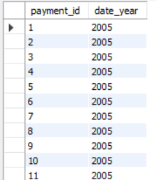

# 数据库常用操作

## 查看有哪些数据库

```mysql
show databases;
```

## 创建数据库

```mysql
create database Testdb;
```

## 创建数据库，并指定编码格式

```mysql
create database mydb character set	utf8mb4;
```

## 使用某个数据库

```mysql
use mydb;
```

## 删除数据库

```mysql
drop database Testdb;
```

# MySQL常用数据类型

## 字符型

字符型指字符串这样的数据，例如姓名、地址、电话号码等。在写SQL语句的时候，字符串需 要使用引号括起来，一般使用单引号。

### char(255)

定长字符串，最大长度为255个字符，定长的意思是即使存入的字符串小于指定长 度，也会分配指定长度的存储空间。

### varchar(255)

可变长度的字符串，按需分配，有利于节省空间。

### text

最大长度为64K的变长文本，例如文章可以以text类型存储。

其他还有如mediumtext，longtext，都属于text类型。

## 数值型

数值型指数字这样的数据，例如人数、金额、销售额等。

### 整型

即整数，用int表示。

### 浮点型

即小数，按照表示的范围又分为以下三种。

#### float

单精度浮点值。

#### double

双精度浮点值。

#### decimal

精度可变的浮点值，精度可变指小数位数随着实际情况而变，有多少位小数就 分配多少存储空间。

## 日期时间型

日期时间型指日期和时间这样的数据，例如2008年1月1日，或者14:00:00。

日期时间型分为日期、时间及日期时间型三种。

### date

日期，包括年、月、日，常用格式为yyyy-mm-dd。

### time

时间，包括时、分、秒。

### datetime

日期时间型，包括年、月、日、时、分、秒。

## 枚举型

枚举类型：enum

'enum(''Asia'',''Europe'',''North America'',''Africa'',''Oceania'',''Antarctica'',''South America'')'

# 数据表常用命令

## 查看有哪些数据库表

```mysql
show tables;
```

## 查询表中的数据

```mysql
select * from city;
```

## limit

```mysql
select * from city limit 100;
```

## 建表

```mysql
create table <tablename>(
<字段名称> <数据类型>,
<字段名称> <数据类型>,
<字段名称> <数据类型>,
......
);
```


## 查看表结构

```mysql
describe <tablename>;
```

## 修改数据表

```mysql
alter table <tablename> add <column> varchar(20);
alter table <tablename> add <column> varchar(20) after <column>;
alter table <tablename> drop <column>;
```

## 重命名表

```mysql
alter table <tablename> rename <new_tablename> ;
```

## 删除数据表

```mysql
drop table <tablename>;
```

## 插入一条记录

```mysql
insert into <tablename>(字段1,字段2,......) values(字段1的值,字段2的值,......);
```

## 插入多条记录

```mysql
insert into <tablename>(字段1,字段2,......) values
(字段1的值,字段2的值,......),
(字段1的值,字段2的值,......),
(字段1的值,字段2的值,......);
```

## 删除记录

```mysql
delete from <tablename> where 字段名=某个值;
```

## 修改记录

```mysql
update <tablename> set 字段1=某个值 where 字段2=某个值;
```

# 常用的查询语句

## 条件查询

```mysql
select * from <tablename> where 字段名=某个值;
```

## 排序

```mysql
select * from country order by population;
select * from country order by population desc;
select * from country order by Name;
```

## 分组

```mysql
select Region,count(*) from country group by Region;
```

## 空值

```mysql
select count(*) from country where indepyear is not null;
select count(*) from country where indepyear is null;
```

## 去重

```mysql
select count(distinct continent) from country;
```

# 常用的汇总函数

## 计数

```mysql
select count(name) from country;
```

## 最大最小值

```mysql
select max(population) from country;
select min(population) from country;
```

## 求和

```mysql
select sum(population) from country;
```

## 求均值

```mysql
select avg(lifeexpectancy) from country;
```

## like

用于字符串查找，查找符合某个匹配模式的字符串

like 'Guang%‘：查找以Guang开头的记录 

like ‘%nan‘：查找已nan结尾的记录

```mysql
select * from city where countrycode = "CHN" and district like "Guang%";
```


```mysql
select * from city where countrycode = "CHN" and district like "%nan";
```


## in

查找属于某个集合的记录

in(‘Hunan’,‘Guangdong’,‘Henan‘)：查找湖南、广东、河南的记录

```mysql
select * from city where district in("Hunan", "guangdong", "henan");
```


## having

条件语句，与where类似，和统计函数连用

having sum(population)>10000000：查找总人口大于1000万的记录

```mysql
select district, sum(population) from city where countrycode = "CHN" group by district having sum(population)>=10000000 order by sum(population) desc;
```


## between and

查找符合某个区间的记录

having sum(population) between 5e6 and 10e6

**注意：包含两个边界的值。**

```mysql
select district, sum(population) from city where countrycode = "CHN" group by district having sum(population) between 5e6 and 10e6 order by sum(population) desc;
```


## union

联合，用于连接两个查询的结果，去重

```mysql
select code from country union select distinct countrycode from city;
```


## union all

连接两个查询的结果，不去重

## date_format

日期格式化

date_format('2005-05-25 11:30:37','%Y’)→2005 

date_format(payment_date,'%Y-%M')

```mysql
select payment_id, date_format(payment_date, "%Y") as date_year from payment;
```



# 表的连接

## 内连接


## 左连接


## 右连接


# case语句


```mysql
select distinct district,
	case district
		when "Peking" then '直辖市'
        when "Tianjin" then '直辖市'
        when "Shanghai" then '直辖市'
        when "Chongqing" then '直辖市'
        else '省份' end as province_level
from city where countrycode = "CHN";
```


```mysql
select name, population,
	case 
		when population>=5e6 then '一线城市'
		when population>=2e6 and population<5e6 then '二线城市'
        else '三线城市' end as city_tier
from city where countrycode = "CHN";
```


# 数据导出

```mysql
select * from city where CountryCode='CHN’ 
into outfile 'E:/data/db_mysql/export/city.csv’
fields terminated by ',' lines terminated by '\r\n’;
```

导出数据可能会遇到错误

The MySQL server is running with the --secure-file-priv option so it  cannot execute this statement。。。

解决方法：修改配置文件my.ini中参数‘secure_file_priv‘的值为空。


# 数据导入

```mysql
load data infile 'E:/data/db_mysql/stuinfo.txt’ 
into table stuinfo
fields terminated by '\t' lines terminated by '\r\n';
```

# 数据查询例子

按客户：客户ID、客户名称、城市、销售额、数量、利润

```mysql
select customerid, customername, city, sum(salesvolume), sum(salesnum), sum(profit) from orders group by customerid;
```

按产品：产品ID、类别、子类别、产品名称、销售额、数量、利润

```mysql
select productid, category, subcategory, productname, sum(salesvolume), sum(salesnum), sum(profit) from orders group by productid;
```

按照地区经理：地区经理、地区、销售额、数量、利润

```mysql
select manager, region_managers.region, sum(salesvolume), sum(salesnum), sum(profit) from orders right join region_managers on orders.region = region_managers.region group by manager;
```

按省份：省份、销售额、数量、利润

```mysql
select province, sum(salesvolume), sum(salesnum), sum(profit) from orders group by province;
```

用一条SQL语句，查询总销售（销售额）大于3000000的地区经理

```mysql
select manager, sum(salesvolume) from orders right join region_managers on orders.region = region_managers.region group by manager having sum(salesvolume) > 3e6;
```

用一条SQL语句，查询退货订单信息

```mysql
select manager, count(distinct date_format(orderdate, '%Y')) as year_num from orders right join region_managers on orders.region = region_managers.region group by manager;
```

用一条SQL语句，查询每个地区经理每年的平均销售金额、平均利润

```mysql
select manager, sum(salesvolume)/count(distinct date_format(orderdate, '%Y')) as sales_avg, 
	sum(profit)/count(distinct date_format(orderdate, '%Y')) as profit_avg
from orders right join region_managers on orders.region = region_managers.region group by manager;
```

用一条SQL语句，查询不同类别的产品的销售金额、利润

```mysql
select category, sum(salesvolume), sum(profit) from orders group by category;
```

用一条SQL语句，查询2017年销售额最高的10个订单

```mysql
select * from orders where date_format(orderdate, '%Y') = '2017' order by salesvolume limit 10;
```

用一条SQL语句，查询出每个月的销售额都大于1万元的城市

```mysql
select city from (select distinct city from orders group by city, date_format(orderdate, '%Y-%m')) as all_city where city not in (select distinct city from orders group by city, date_format(orderdate, '%Y-%m') having sum(salesvolume)<=10000);
```

用一条SQL语句，查询2017年5月到10月的订单，按照月份升序排序，月份相同的按照销售金额降序排序

```mysql
select oid, date_format(orderdate, '%Y-%m') as orderYM, salesvolume from orders where date_format(orderdate, '%Y-%m') between '2017-05' and '2017-10' order by orderYM, salesvolume desc;
```

# 索引


## 创建索引

```mysql
create index oid_index on orders(oid);
```

```mysql
alter table orders add index cid_index(customerid);
```

## 删除索引

```mysql
drop index cid_index on orders;
```

## explain语句

分析查询语句使用索引的情况。

```mysql
explain select * from orders where oid='US-2017-1357144';
```


# 函数


## 创建函数

```mysql
delimiter //
create
	function customer_sales(ct_name varchar(10))
    returns int
begin
	declare sales_num int;
    select sum(salesnum) into sales_num from orders where customername=ct_name group by customername;
    return sales_num;
end //
delimiter ;
```

## 调用自定义函数

```mysql
select customer_sales('邹涛');
```

## 删除自定义函数

```mysql
drop function customer_sales;
```

# 存储过程


## 创建存储过程

```mysql
delimiter //
create
	procedure ct_info(ct_name varchar(10))
begin
	select * from orders where customername=ct_name;
end //
delimiter ;
```

## 调用存储过程

```mysql
call ct_info('马丽');
```

## 删除存储过程

```mysql
drop procedure ct_info;
```


# 游标


## 创建游标

```mysql
delimiter //
create procedure days_rst_pro(ct_name varchar(10))
begin
    declare done int default 0;
    declare para_id int(5);
    declare para_oid varchar(20);
    declare para_senddate date;
    declare para_orderdate date;
    declare days_cursor cursor for select id, oid, senddate, orderdate from orders where customername=ct_name;
    declare continue handler for not FOUND set done = 1;
    open days_cursor;
    repeat
		fetch days_cursor into para_id, para_oid, para_senddate, para_orderdate;
        if not done then
			insert into delivery_days_tb(id, oid, delivery_days)
				select para_id, para_oid, datediff(para_senddate, para_orderdate) as delivery_dates;
		end if;
	until done end repeat;
    close days_cursor;
end //
delimiter ;
```

## 打开游标

```mysql
open days_cursor;
```

## 使用游标

```mysql
fetch days_cursor into para_id,...;
```

## 关闭游标

```mysql
close days_cursor;
```

## 循环

```mysql
declare done int default 0;
declare continue handler for not FOUND set done = 1;
repeat
...... #循环体语句
until done end repeat;
```

# 事务


## 开启事务

```mysql
begin;
```

```mysql
start transaction;
```

## 事务回滚

```mysql
ROLLBACK
```

撤销指定sql语句的过程

## 事务确认

```mysql
COMMIT
```

将为存储的sql语句结果写入数据表

## 保留点

```mysql
SAVEPOINT
```

事务处理中设置的临时占位符，可以对它发布回退


