# 概率论

# 统计学

## Excel求众数

单个：MODE.SNGL

多个：MODE.MULT

## 求平均数

average

## 求中位数

median

## 求四分位数

QUARTILE.INC()

## 求方差

var.p

## 标准差

STDEV.P

## 偏态

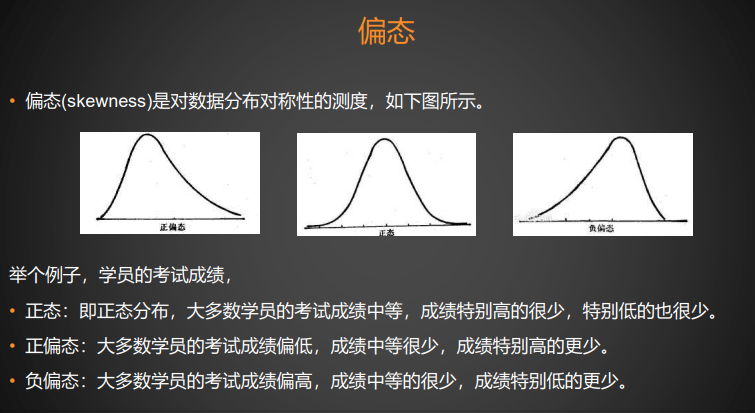

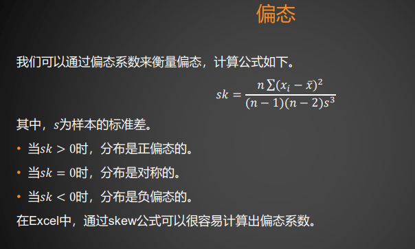

## 峰态

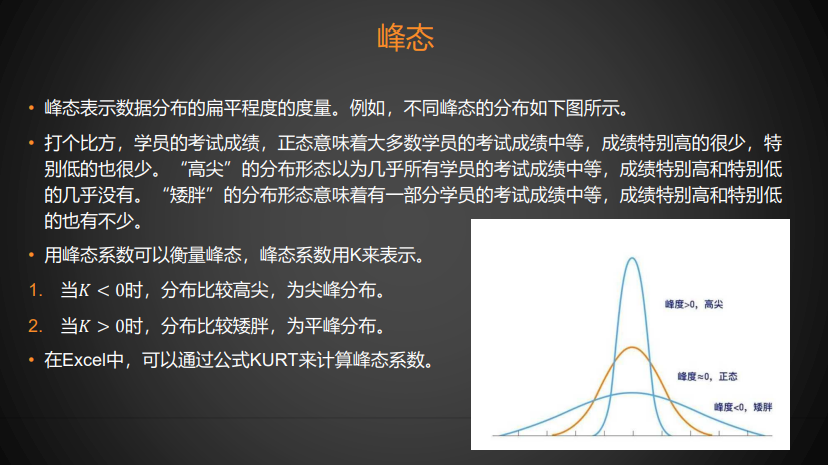

## 卡方分布

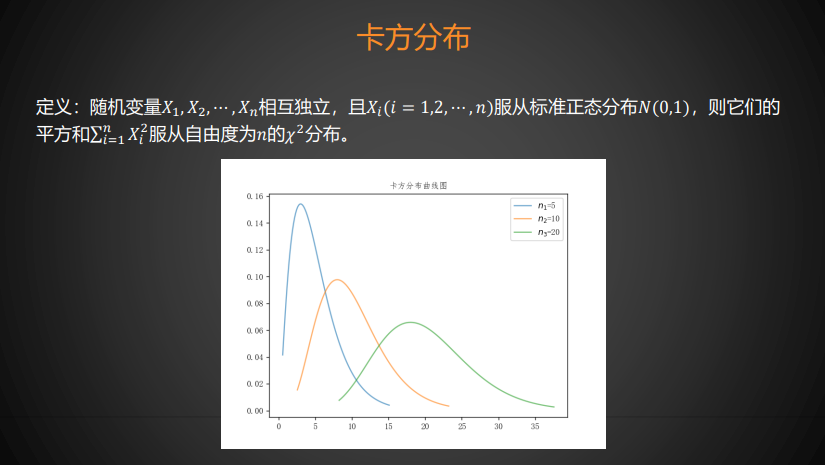

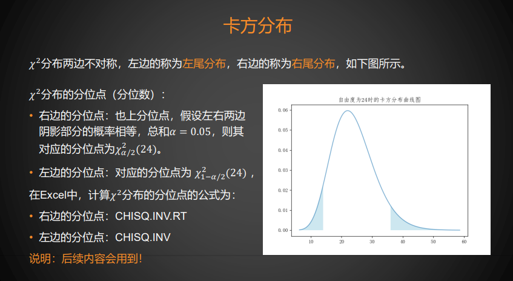

## t分布

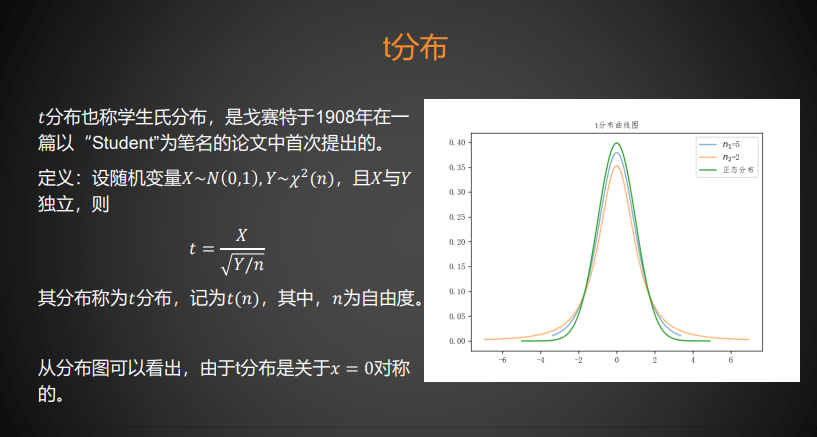

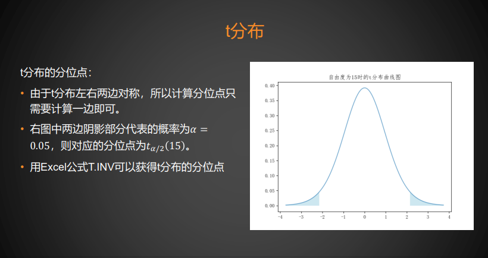

## F分布

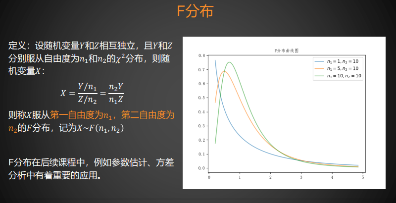

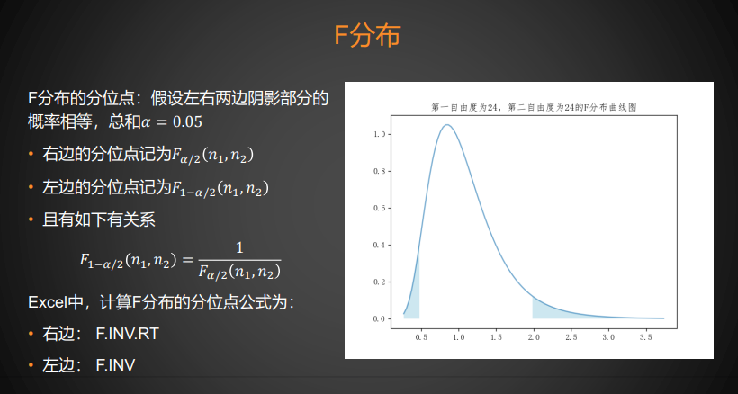

## 样本均值的分布

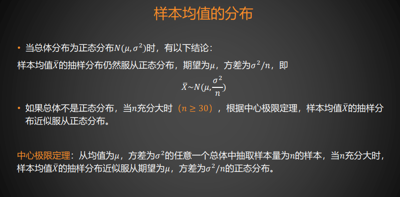

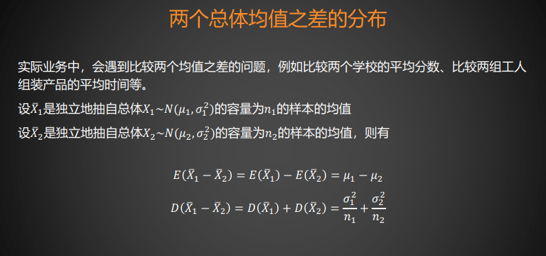

## 样本比例的分布

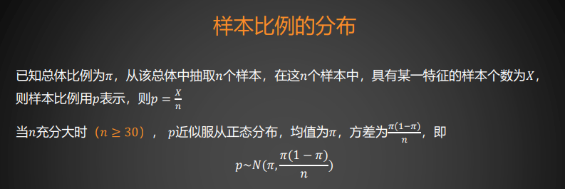

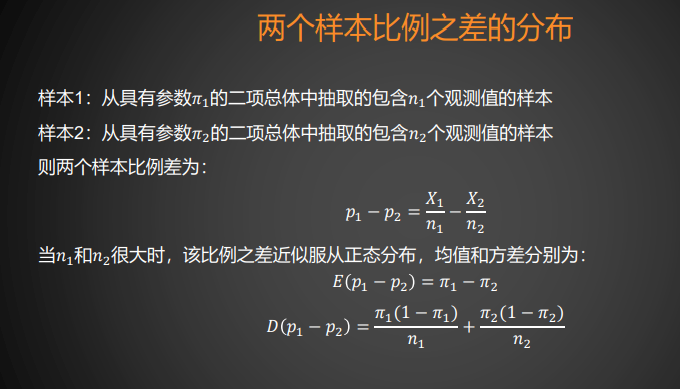

# 参数估计

